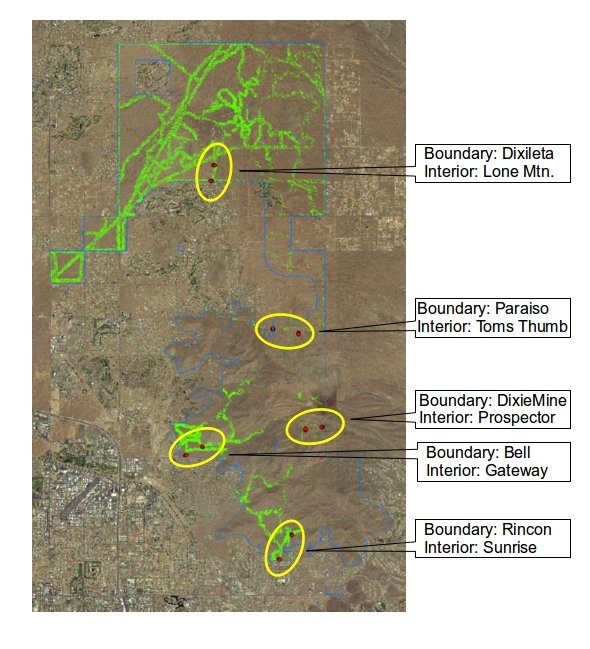

rdm-lecture-rmarkdown
================
spring 2020

### learning goals

  - introductions to:
      - literate programming
      - markdown and Rmarkdown
      - advanced Rmarkdown features and output types
  - additional practice working with R, RStudio, and GitHub

### background

We will use data from work that the [CAP
LTER](https://sustainability.asu.edu/caplter/) is conducting on the
arthropod community in the [McDowell Sonoran
Preserve](https://www.scottsdaleaz.gov/preserve) in conjunction with the
[McDowell Sonoran Conservancy](https://www.mcdowellsonoran.org/) to gain
additional experience working with R, RStudio, and Git/GitHub, and to
explore more advanced Rmarkdown formatting and output types.

As with all [LTER](https://lternet.edu/) data, [data for this
project](https://portal.edirepository.org/nis/mapbrowse?scope=knb-lter-cap&identifier=643)
are available through the Environmental Data Initiative [data
portal](https://portal.edirepository.org/nis/home.jsp).

#### arthropod research: project overview

As part of the McDowell Sonoran Field Institute’s (MSFI) broader effort
to establish a baseline inventory of biota in the McDowell Sonoran
Preserve (Scottsdale, AZ), investigators with the Central
Arizona−Phoenix Long-Term Ecological Research (CAP LTER) project at
Arizona State University (ASU) are monitoring ground-dwelling arthropods
at select locations that reflect a diversity of habitat within the
Preserve. Investigators employed a sampling design that was intended to
provide insight regarding influence of the urban-wildland interface on
the arthropod community within the protected area. The simple but
effective technique of pitfall trapping was used to sample
ground-dwelling arthropods at select locations spanning a wide range of
habitat with the Preserve.

#### arthropod research: methods

Ten transects for the collection of ground-dwelling arthropods were
established. Each transect consists of 10 traps spaced ~5m apart along a
transect line established perpendicular to slopes. Each trap consists of
a short (~6 in.) section of 4-in. pipe buried flush with the soil
surface. Traps are covered with a tight-fitting PVC cap until being set
at which time the cap is removed and a 16-oz. plastic cup is inserted
into the pipe. Traps are left uncovered for ~72 consecutive hours until
the sample cup is collected. Upon collection, trap contents are
transferred to sample jars containing 70% ethyl alcohol for
preservation, and subsequent transport to ASU for sorting and
identification. Arthropods are sorted to the lowest practical taxonomic
(LPT) level.

Pitfall trap transect locations include five groups of paired transects
that span a large range of the north-south and east-west axes of the
Preserve (Figure 1), and include numerous unique vegetation communities.
Four transect pairs are positioned such that one transect is within 100
m of the Preserve boundary and existing development, and the second
transect at least 0.5 km from the Preserve boundary/development. A fifth
control paired transect is located in a similar fashion but at a
location where there is not currently development near the Preserve
boundary (Dixie Mine and Prospector; Figure 1). Transect locations were
selected specifically to include relatively similar geomorphological
characteristics, including elevation (610-914 m), slope (≤ 20%), and
aspect (0-270°, 315-360°) to minimize extraneous factors. All transects
are positioned within 75 m of existing trails to facilitate access and
limit off-trail travel while keeping traps out of public view.

Sampling is conducted quarterly in keeping with CAP LTER protocols and
concomitant sampling at other central Arizona
locations.

*Figure 1. Approximate location of paired sampling sites (red dots
within yellow ellipses); the Preserve boundary is outlined in blue.*
