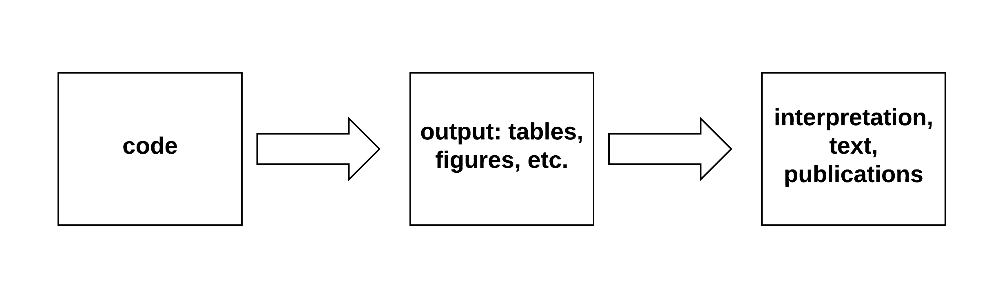

.center[
  
]

.footnote[[R for Data Science](https://r4ds.had.co.nz/)]

???

#### workflow

---

.center[
  
]

.footnote[
- K. Healy [The Plain Person's Guide to Plain Text Social Science](https://kieranhealy.org/files/papers/plain-person-text.pdf)
- D. E. Knuth [Literate Programming](http://www.literateprogramming.com/knuthweb.pdf)
]

--

a problem is that the gaps are particularly prone to errors; literate
programming addresses this through the integration of code and text

???

#### literate programming: a common approach
